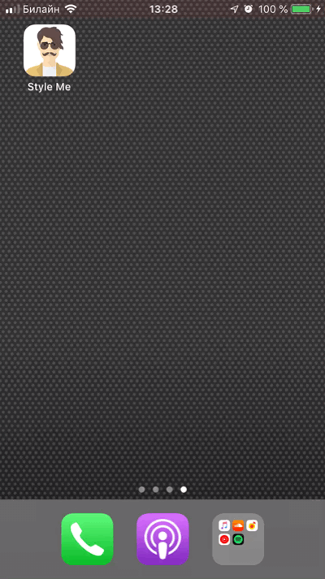

# Style Me!

The project aims to implement an iOS application for Neural Style Transfer on photos of people.

### Functionality
* User can either take a photo with front/back camera or upload one the photo gallery.
* One can generate stylized version of the uploaded photo.
* Generated photo can be saved on the device.

### How does it work?
* Binary classification model (human/not human) implemented and trained with `Keras`, and converted into `CoreML` format, which allows performing classification of client-side. 

* The `PyTorch` model performs Neural Style Transfer as a part of the web-service, implemented with `aiohttp`.

### Versioning

[SemVer](https://semver.org) is used for versioning. For the versions available, see the 
[tags on this repository](https://github.com/snk4tr/style-me/releases).

### License

This project is licensed under the Apache License 2.0 - see the [LICENSE](LICENSE) file for details.

### Authors

* **Sergey Kastryulin** - _Initial work_ - [snk4tr](https://github.com/snk4tr)